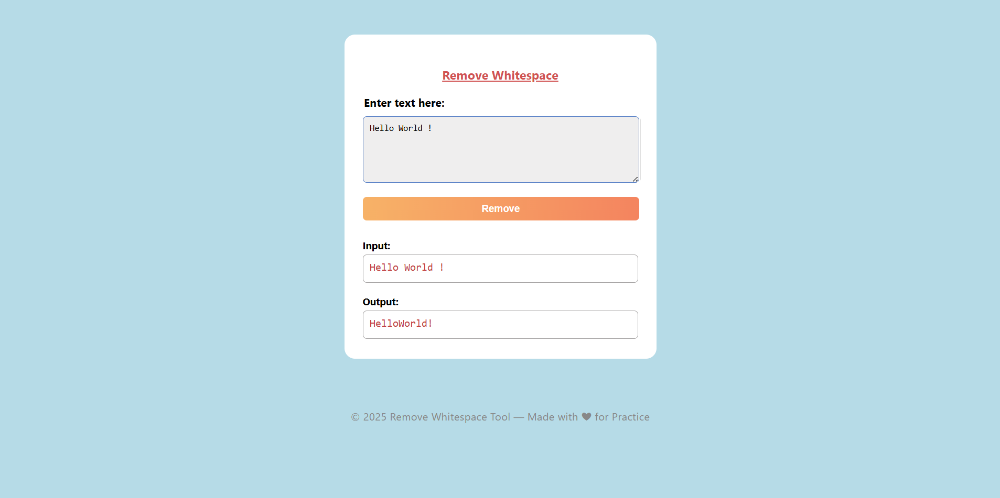

## Remove WhiteSpace

This is a simple and elegant web-based tool to remove all whitespace characters (spaces, tabs, newlines, etc.) from a given input string.  
It is built using HTML, CSS, and JavaScript — no dependencies required.

---
### How It Works
- The JavaScript captures form submission.
- It prevents default behavior and processes the input text.
- Whitespace is removed using the RegEx
- Results are displayed  and styled.
---
### Screenshot

